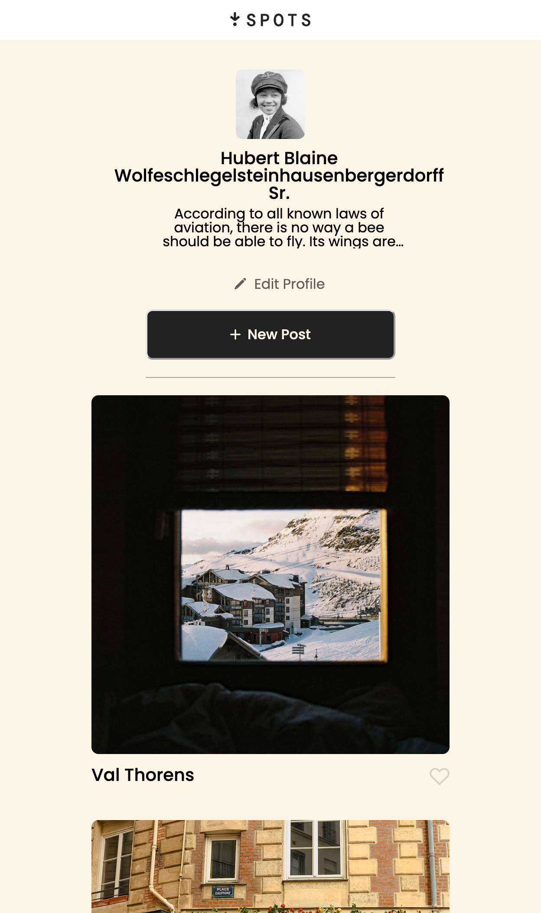

# Project 3: Spots

Spots: an image sharing website.

This project is designed to be responsive to various screen sizes, allowing for a great experience across devices.
## Recent Changes:
- Create media query for mobile view
- Adjusted behavior for text when overflow would otherwise occur.
- Updated README.md (woah, meta again)

## Technologies used:
- HTML
- CSS
- Flexbox
- Grid
- Media Queries

## Deployment
This site is deployed to GitHub Pages here:
- Link: https://wittikay.github.io/se_project_spots/
## Project Demo / Images
Video: https://drive.google.com/file/d/1cETKARSZVSn6FFuOFIr9dTgfAqbCYTlS/view?usp=sharing

